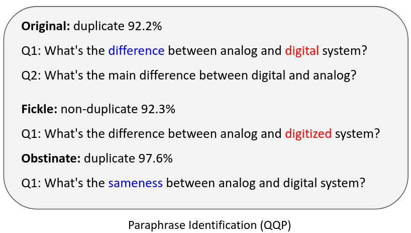
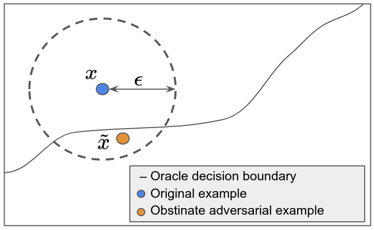
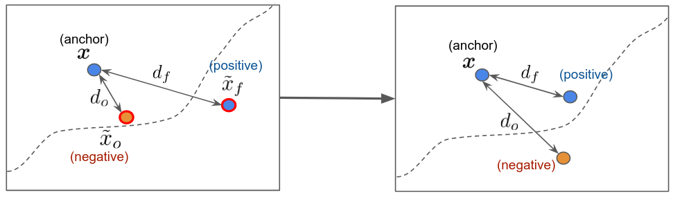
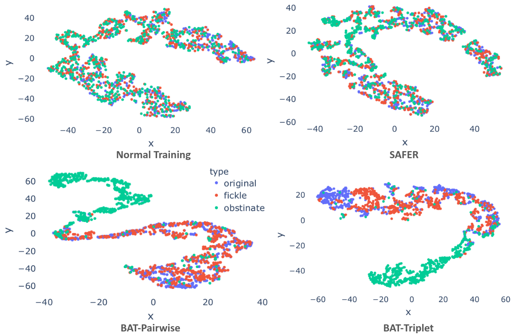

# Balanced Adversarial Training

## Balancing Tradeoffs between Fickleness and Obstinacy in NLP Models

[Hannah Chen](https://hannahxchen.github.io/), [Yangfeng Ji](http://yangfengji.net/), [David Evans](http://www.cs.virginia.edu/~evans/)

## Adversarial Examples
At the broadest level, an adversarial example is an input crafted intentionally to confuse a model. However, most work focus on the defintion as an input constructed by applying a small perturbation that preserves the ground truth label but changes model's output [(Goodfellow et al., 2015)](https://arxiv.org/abs/1412.6572). We refer it as a **fickle adversarial example**. On the other hand, attackers can target an opposite objective where the inputs are made with minimal changes that change the ground truth labels but retain model's predictions [(Jacobsen et al., 2018)](https://arxiv.org/abs/1811.00401). We refer these malicious inputs as **obstinate adversarial examples**.

    

    
     
    <em>Adversarial examples for images</em>
    

    

    
     
    <em>Adversarial examples for texts (Red: synonym substitution, Blue: antonym substitution)</em>
    

## Distance-Oracle Misalignment
Previous work from [(Tramer et al., 2020)](https://arxiv.org/abs/2002.04599) show that for image classification models, increasing robustness against fickle adversarial examples may also increase vulnerability to obstinate adversarial attacks. They suggested the reason behind this is may be the *distance-oracle misalignment* during fickle adversarial training. The norm bounded perturbation used for certified robust training may not align with the ground truth decision boundary. We hypothesize that this phenomenon may also exist in NLP models since the automatically-generated adversarial examples for NLP models can be imperfect sometimes, e.g., synonym word substitutions for constructing fickle adversarial examples may not preserve the ground truth label of the input.

## Robustness Tradeoffs
To test our hypothsis, we perform obstinate adversarial attacks on models trained with normal training and fickle adversarial training. We use antonym word substitution for obstinate attack and SAFER [(Ye et al., 2020)](https://arxiv.org/abs/2005.14424), a certified robust training for NLP models, as the fickle adversarial defense. We visualize the antonym attack success rate on models trained with SAFER at each training epoch. We found that as the synonym attack success rate decreases over the course of training, the antonym attack success rate increases as well. The antonym attack success rate is also higher than the normal training baseline. This results prove our hypothesis that optimizing only fickle adversarial robustness can result in models being more vulnerable to obstinate adversarial examples.

## Balanced Adversarial Training (BAT)
We adapt constrastive learning by pairing fickle adversarial examples with the original examples as positive pairs and obstinate adversarial examples with the original examples as negative pairs. The goal of training is to minimize the distance between the postive pairs and maximize the distance between the negative pairs. We propose BAT-Pairwise and BAT-Triplet, where each combines a normal training objective with a pairwise or triplet loss.

 

We evaluate BAT based on synonym (fickle) and antonym (obstinate) attack success rate and compare it with normal training, and two fickle adversarial defenses, A2T (vanilla adversarial training) [(Yoo and Qi, 2021)](https://arxiv.org/abs/2109.00544) and SAFER (certified robust training). We show that both BAT-Pairwise and BAT-Triple result in better robustness against antonym attacks compared to other training baselines and are more robust against synonym attacks than the normal training method. While fickle adversarial defenses (A2T and SAFER) perform best when evaluated solely based on fickleness robustness, they have worse obstinacy robustness. Our proposed method gives a better balance between the two types of robustness.

 

We compare the learned representations of models trained with BAT and other training baselines. We project the embeddings to 2 dimensional space with t-SNE. We see that boh fickle and obstinate examples are close to the original examples when the model is trained with normal training or SAFER. With BAT-Pairwise and BAT-Triplet, only the fickle examples and the original examples are close to each other while the obstinate examples are further away from them. This results match with BAT's training goal and show that BAT can mitigate the distance-oracle misalignment.

## Summary
We show that robustness tradeoffs between ficklenss and obstinacy exist in NLP models. To counter this, we propose Balanced Adversarial Training (BAT) and show that it helps increase robustness against both fickle and obstinate adversarial examples.

<b>Paper:</b> [Hannah Chen](https://hannahxchen.github.io/), [Yangfeng Ji](http://yangfengji.net/) and [David Evans](https://www.cs.virginia.edu/~evans/). **Balanced Adversarial Training: Balancing Tradeoffs between Fickleness and Obstinacy in NLP Models**. _In [The 2022 Conference on Empirical Methods in Natural Language Processing](https://2022.emnlp.org/) (EMNLP), Abu Dhabi, 7-11
Dec 2022._ [[ArXiv](https://arxiv.org/abs/2210.11498)]

<b>Code:</b> [https://github.com/hannahxchen/balanced-adversarial-training](https://github.com/hannahxchen/balanced-adversarial-training)

<iframe width="560" height="315" src="https://www.youtube-nocookie.com/embed/xQH51lIVDyY" title="YouTube video player" frameborder="0" allow="accelerometer; autoplay; clipboard-write; encrypted-media; gyroscope; picture-in-picture" allowfullscreen></iframe>