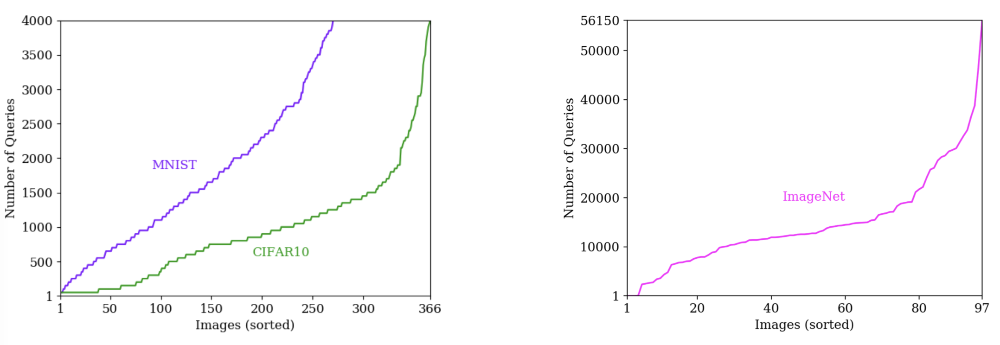

+++
date = "14 Dec 2019"
draft = false
author = "Fnu Suya"
title = "USENIX Security 2020: Hybrid Batch Attacks"
categories = ["publications"]
tags = ["adversarial machine learning", "Fnu Suya", "Yuan Tian", "Jianfeng Chi", "USENIX Security"]
+++

<b>New: [Video Presentation](/hybrid-batch-attacks-at-usenix-security-2020/)</b>

## Finding Black-box Adversarial Examples with Limited Queries

Black-box attacks generate adversarial examples (AEs) against deep
neural networks with only API access to the victim model. 

Existing black-box attacks can be grouped into two main categories:

- **Transfer Attacks** use white-box attacks on local models to find
candidate adversarial examples that transfer to the target model.  

- **Optimization Attacks** use queries to the target model and apply
optimization techniques to search for adversarial examples.

### Hybrid Attack

We propose a _hybrid attack_ that combines transfer and optimization attacks:

1. Transfer Attack &rarr; Optimization Attack &mdash; take candidate adversarial examples of the local models of transfer attacks as the starting points for optimization attacks. 

2. Optimization Attack &rarr; Transfer Attack &mdash; intermediate query results from the optimization attacks are used to fine-tune the local models of transfer attacks.

We validate effectiveness of the hybrid attack over the baseline on three benchmark datasets: MNIST, CIFAR10, ImageNet. In this post, we only show the results of [AutoZOOM](https://arxiv.org/abs/1805.11770) as the selected optimization method. More results of other attacks can be found in the [paper](../docs/hybrid_attack.pdf). 

## Local Adversarial Examples are Useful (Transfer &rarr; Optimization)

Below, we compare the performance of AutoZOOM attack when it starts
from 1) the local adversarial examples, and 2) the original
points. Here, we report results for targeted attacks on normal (i.e.,
non-robust) models:

Local AEs can substantially boost the performance of optimization
attacks, but when the same attack is used against [robust
models](https://github.com/MadryLab/cifar10_challenge), the improvement is small:

<a href="</a>

This ineffectiveness appears to stem from differences in the attack
space of normal and robust models. Therefore, to improve effectiveness
against robust target model, we use robust local models to produce the
transfer candidates for starting the optimization attacks. The figure
below compares impact of normal and robust local models when attacking
the robust target model:

## Tuning with Byproduces Doesn't Help Much (Optimization &rarr; Transfer)

Below, we compare the performance of AutoZOOM attack on MNIST normal
model when the local models are 1) fine-tuned during the attack
process, and 2) kept static:

Tuining local models using byproducts from the optimization attack
improves the query efficiency. However, for more complex datasets
(e.g., CIFAR10), we observe degradation in the attack performance by
fine-tuning (check Table 6 in the [paper](../docs/hybrid_attack.pdf)).

## Batch Attacks

We consider a **batch attack** scenario: adversaries have limited
number of queries and want to maximize the number of adversarial
examples found within the limit. This is a more realistic way to
evaluate attacks for most adversarial purposes, then just looking at
the average cost to attack each seed in a large pool of seeds.

The number of queries required for attacking a specific seed varies
greatly across seeds:

Based on this observation, we propose **two-phase strategy** to prioritize easy seeds for the **hybrid attack**: 

1. In the first phase, the likely-to-transfer seeds are prioritized
based on their PGD-steps taken to attack the local models. The
candidate adversarial example for seed seed is attempted in order to
find all the direct transfers.

2. In the second phase, the remaining seeds are prioritized based on
their target loss value with respect to the target model.

To validate effectievness of the two-phase strategy, we compare to two seed prioritization strategies:

- **Retroactive Optimal**: a non-realizable attack that assumes adversaries already know the exact number of queries to attack each seed (before the attack starts) and can prioritize seeds by their actual query cost. This provides an lower bound on the query cost for an optimal strategy.

- **Random:** this is a baseline strategy where seeds are prioritized in random order (this is the stragety assumed in most works where the adverage costs are reported).

Results for the AutoZOOM attack on a normal ImageNet model are shown below:

Our two-phase strategy performs closely to the retroactive optimal
strategy and outpeforms random baseline significantly: with same
number of query limit, two-phase strategy finds significantly more
adversarial examples comapred to the random baseline, and is closer to
the retroactive optimal case. (See the paper for more experimental
results and variations on the prioritization strategy.)

### Main Takeaways

- **Transfer &rarr; Optimization:** local adversarial examples can generally be used to boost optimization attacks. One caveat is, against robust target model, hybrid attack is more effective with robust local models. 

- **Transfer &rarr; Optimization:** fine-tuning local models is only helpful for small scale dataset (e.g., MNIST) and fails to generalize to more complex datasets. It is an open question whether we can make the fine-tuning process work for complex datasets. 

- **Prioritizing seeds** based on two-phase strategy for the hybrid attack can significantly improve its query efficiency in batch attack scenario. 

Our results make the case that it is important to evaluate both
attacks and defenses with a more realistic adversary model than just
looking at the average cost to attack a seed over a large pool of
seeds. When an adversary only need to find a small number of
adversarial examples, and has access to a large pool of potential
seeds to attack (of equal value to the adversary), then the effective
costs of a successful attack can be orders of magnitude lower than
what would be projected assuming an adversary who cannot prioritize
seeds to attack.

## Paper

<a href="https://fsuya.org">Fnu Suya</a>, <a href="https://www.linkedin.com/in/jianfeng-chi-001b25133/">Jianfeng Chi</a>, <a href="http://www.cs.virginia.edu/~evans/">David Evans</a> and <a href="https://www.ytian.info">Yuan Tian</a>. [_Hybrid Batch Attacks: Finding Black-box
Adversarial Examples with Limited Queries_](https://arxiv.org/pdf/1908.07000.pdf). In [_USENIX Security 2020_](https://www.usenix.org/conference/usenixsecurity20). Boston, August 2020. [[PDF](/docs/hybrid_attack.pdf)]&nbsp;[[arXiv](https://arxiv.org/abs/1908.07000)] 

  <video width="90%" id="usenix-media-video-1" data-setup="{}" poster="" class="video-js vjs-default-skin vjs-big-play-centered" preload="auto" controls>
    <source src='https://2459d6dc103cb5933875-c0245c5c937c5dedcca3f1764ecc9b2f.ssl.cf2.rackcdn.com/sec20/videos/0813/s5_machine_learning_1/3_sec20summer-paper412-presentation-video.mp4' type='video/mp4; codecs="avc1.42E01E, mp4a.40.2"'>
  </video>  
<a href="https://2459d6dc103cb5933875-c0245c5c937c5dedcca3f1764ecc9b2f.ssl.cf2.rackcdn.com/sec20/videos/0813/s5_machine_learning_1/3_sec20summer-paper412-presentation-video.mp4">Download Video [mp4]</a>

## Code

[https://github.com/suyeecav/Hybrid-Attack](https://github.com/suyeecav/Hybrid-Attack)

In this repository, we provide the source code to reproduce the results in the paper. In addition, we believe our hybrid attack framework can (potentially) help boost the performance of new optimization attacks. Therefore, in the repository, we also provide tutorials to incorporate new optimization attacks into the hybrid attack framework. 
