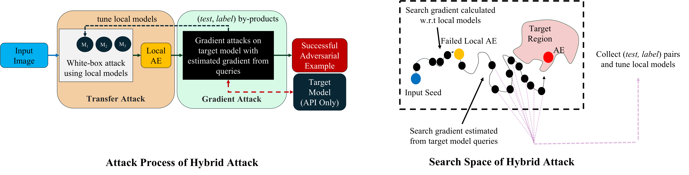
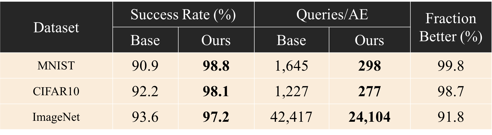
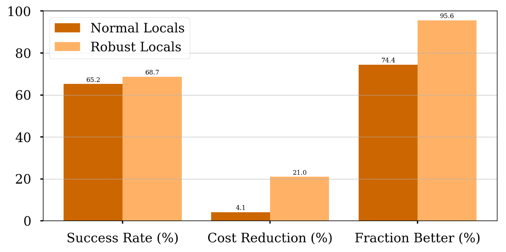

+++
date = "09 Dec 2019"
draft = true
title = "USENIX Security 2020: Hybrid Batch Attacks"
categories = ["publications"]
tags = ["adversarial machine learning", "Fnu Suya", "USENIX Security", "black-box attacks"]
+++

## Finding Black-box Adversarial Examples with Limited Queries

Black-box attacks generate adversarial examples (AEs) against deep neural networks with only API access to the victim model. Existing black-box attacks can be grouped into two main categories: 
> - **Transfer Attack:** use white-box attacks on local models to find candidate adversarial examples that transfer to the target model. 
> - **Optimization Attack:** use queries to the target model and apply optimization techniques to search for adversarial examples.    

### Hybrid Attack
In this work, we propose hybrid attack that combines transfer and optimization attacks as follows:
> -  **Transfer Attack -> Optimization Attack:** take candidate adversarial examples of the local models of transfer attacks as the starting points for optimization attacks. 
> - **Optimization Attack -> Transfer Attack:** intermediate query results from the optimization attacks are used to fine-tune the local models of transfer attacks.

The hybrid attack process and the search space (of adversarial examples) are visualized below.

We validate effectiveness of the hybrid attack over baseline method on three benchmark datasets: MNIST, CIFAR10, ImageNet. In this post, we only show the results of [_AutoZOOM_](https://arxiv.org/abs/1805.11770) as the selected optimization method. More results can be found in the [paper](../docs/hybrid_attack.pdf). 

#### Local adversarial examples are useful (Transfer -> Optimization)
Below, we compare the performance of AutoZOOM attack when it 1) starts from local adversarial examples, and 2) starts from the original points. We perform targeted attack on normal (i.e., standard) models. We find that local AEs can generally boost the performance of optimization attacks.

We further test performance of hybrid attack against [robust models](https://github.com/MadryLab/cifar10_challenge), but found hybrid attack is not significant over the baseline in this case (shown below).  

We found the ineffectiveness stems from the differences in the vulnerability space of normal and robust models. Therefore, to improve effectiveness against robust target model, we should deploy robust local models (shown below).

#### Fine-tuning does NOT always help (Optimization -> Transfer)
Below, we compare the performance of AutoZOOM attack on MNIST normal model when the local models are 1) fine-tuned during the attack process, and 2) kept static.
results of AutoZOOM attack on MNIST dataset are shown below. We find fine-tuinng local models further improves the query efficiency. However, for more complex datasets (e.g., CIFAR10), we observe degradation in the attack performance by fine-tuning (check Table 6 in the [paper](../docs/hybrid_attack.pdf)).

#### Takeaway
> - **Transfer -> Optimization:** local adversarial examples can generally be used to boost optimization attacks. One caveat is, against robust target model, hybrid attack is more effective with robust local models. 
> - **Transfer -> Optimization:** fine-tuning local models is only helpful for small scale dataset (e.g., MNIST) and fails to generalize to more complex datasets. It is an open question whether we can also make the fine-tuning process work well on complex datasets. 

### Batch Attack
We consider a **batch attack** scenario: adversaries have limited number of queries and want to maximize the number of adversarial examples found within the limit. 

We find that number of queries required for attacking a specific seed vary significantly across seeds. 

With this observation, we propose two-phase strategy to prioritize easy seeds for the **hybrid attack**: 
> - First Phase: the likely-to-transfer seeds are prioritized based on their PGD-steps taken to attack the local models.
> - Second Phase: the easy-to-attack (i.e., require smaller number of queries) seeds are prioritized based on their target loss value with respect to the target model. 

To validate effectievness of the two-phase strategy, we further compare to two seed prioritization strategies:

> - **Retroactive Optimal:** we assume adversaries already know the exact number of queries to attack each seed (before the attack starts) and seeds are prioritized based on the actual query cost. Retroactive optimal strategy is an (ideal) upper bound for our two-phase strategy. 
> - **Random:** this is a baseline strategy and seeds are prioritized in random order.

Result of AutoZOOM attack on ImageNet is shown below. We find our two-phase strategy performs closely to the retroactive optimal strategy and outpeforms random baseline significantly: for the same number of query limit, two-phase strategy finds significantly more adversarial examples comapred to the random baseline. 

#### Takeaway
Prioritizing seeds based on two-phase strategy for the hybrid attack can significantly improve its query efficiency in batch attack scenario. We call the whole startegy as **Hybrid Batch Attack**.

## Paper

<a href="https://fsuya.org">Fnu Suya</a>, <a href="https://www.linkedin.com/in/jianfeng-chi-001b25133/">Jianfeng Chi</a>, <a href="http://www.cs.virginia.edu/~evans/">David Evans</a> and <a href="https://www.ytian.info">Yuan Tian</a>. [_Hybrid Batch Attacks: Finding Black-box
Adversarial Examples with Limited Queries_](https://arxiv.org/pdf/1908.07000.pdf). In [_USENIX Security 2020_](https://www.usenix.org/conference/usenixsecurity20). Boston, August 2020. [[PDF](/docs/hybrid_attack.pdf)]&nbsp;[[arXiv](https://arxiv.org/abs/1908.07000)] 

## Code

[https://github.com/suyeecav/Hybrid-Attack](https://github.com/suyeecav/Hybrid-Attack)

In this repository, we provide the source code to reproduce the results in the paper. In addition, we believe our hybrid attack framework can (potentially) help boost the performance of new optimization attacks. Therefore, in the repository, we also provide tutorials to incorporate new optimization attacks into the hybrid attack framework. 
